# 개발자 포트폴리오

## 📋 프로젝트 목록

### 🔗 [INFINITUM](#infinitum-project)
### 🔗 [JUNGCHUL](#jungchul-portfolio) 
### 🔗 [ISTOCKMALL](#istockmall-portfolio)

---

## INFINITUM Project

**CBTExamApp** - 전자시험용 클라이언트 애플리케이션

### 📋 프로젝트 정보
- **개발회사:** 인피니텀(주) 
- **개발자:** 황두환 <hduhwan@gmail.com>
- **버전:** v1.0.3
- **목적:** CBT(Computer Based Testing) 시험 중 부정행위 방지

### 🛠 기술 스택
- **프레임워크:** Electron v37.2.3
- **빌드 도구:** Electron-Builder v26.0.12  
- **언어:** JavaScript, HTML, CSS
- **보안 도구:** block_keys.exe (시스템 키 차단)
- **설정 파일:** JSON (config.json)
- **패키지 매니저:** NPM
- **라이센스:** UNLICENSED (내부용)

### 🔧 주요 기능

- 전체화면 고정 (Fullscreen / Kiosk 모드)
- 시스템 키 차단 (예: Alt+Tab, Alt+F4, Ctrl+Shipt+Esc, Windows 키, PrintScreen, F1~F12, ESC, INSERT 등)
- 외부 프로그램 실행 방지 및 종료
- 포커스 이탈 감지 및 자동 복구
- 설정 파일(config.json) 기반 커스터마이징
- 보안 보조 프로세스 실행 (block_keys.exe 등)

---

## 설치 및 실행 방법

1. 압축을 해제하거나 `CBTExamApp.exe`를 통해 설치합니다.
2. 설치 후 `CBTExamApp.exe`를 실행하면 자동으로 전체화면 모드로 진입합니다.
3. `config.json`에 시험경로를 변경할 수 있습니다.

### 📋원주 보훈공단 파견 근무 수검용 프로그램 개발(4개월)  

### 🛠 기술 스택
- **개발도구:** Easymaker
- **백엔드:** Java (Eclipse IDE)
- **프레임워크:** 전자정부프레임워크 3.8
- **ORM:** JPA (Java Persistence API)
- **데이터베이스:** Oracle

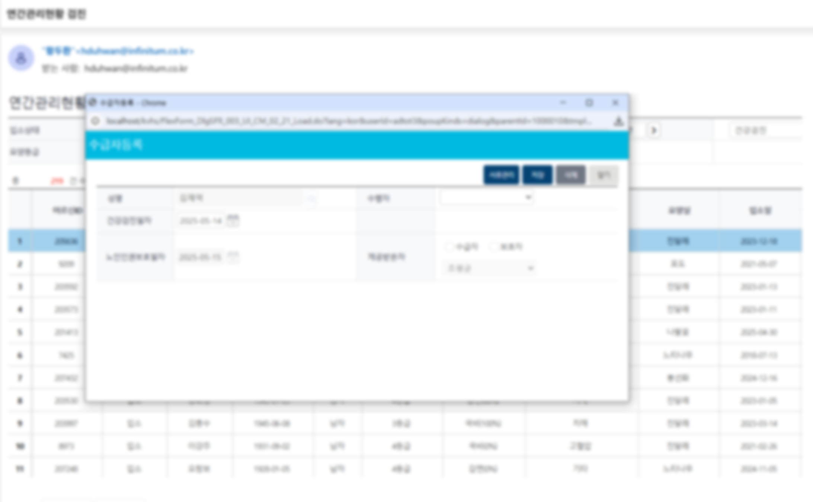
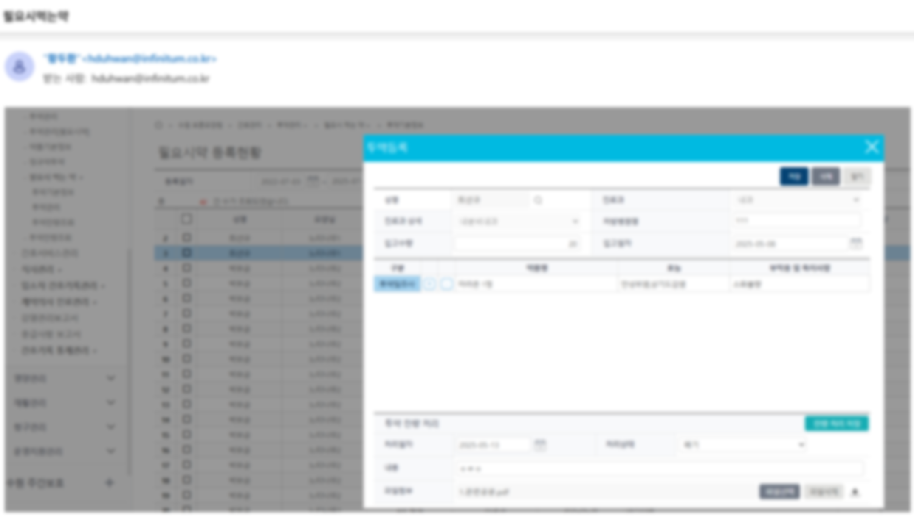
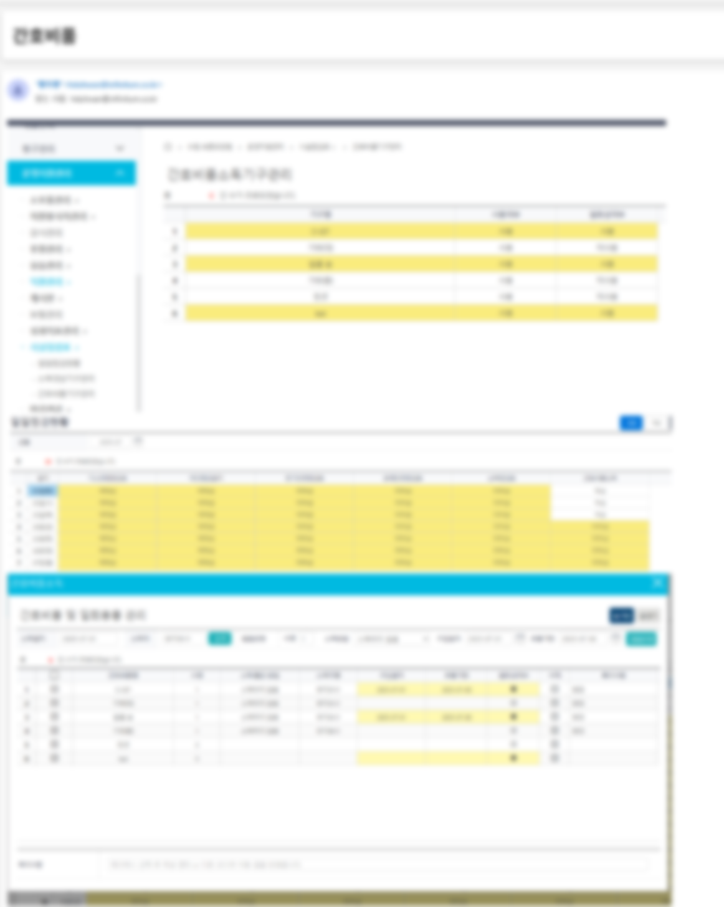

---

## JUNGCHUL Portfolio

### 컨테츠 / 인증 시험 개발 

**jr.jungchul.com** (주니어 E-러닝 콘텐츠 개발)
- **개발기간:** 2020년 7월 ~ 2021년 7월    
- **기술스택:** JavaScript, jQuery AJAX, JSON, ASP, PHP, MSSQL 2012
- **주요기능:** 학습 콘텐츠 개발(음성인식), 영어인증시험 개발 

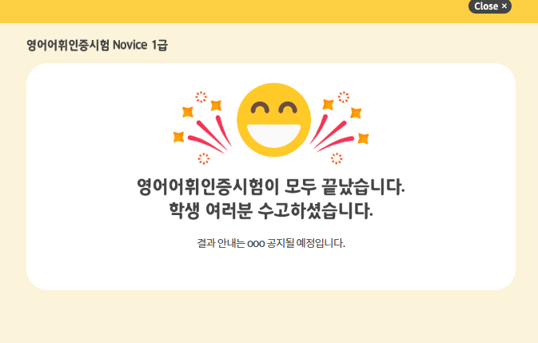

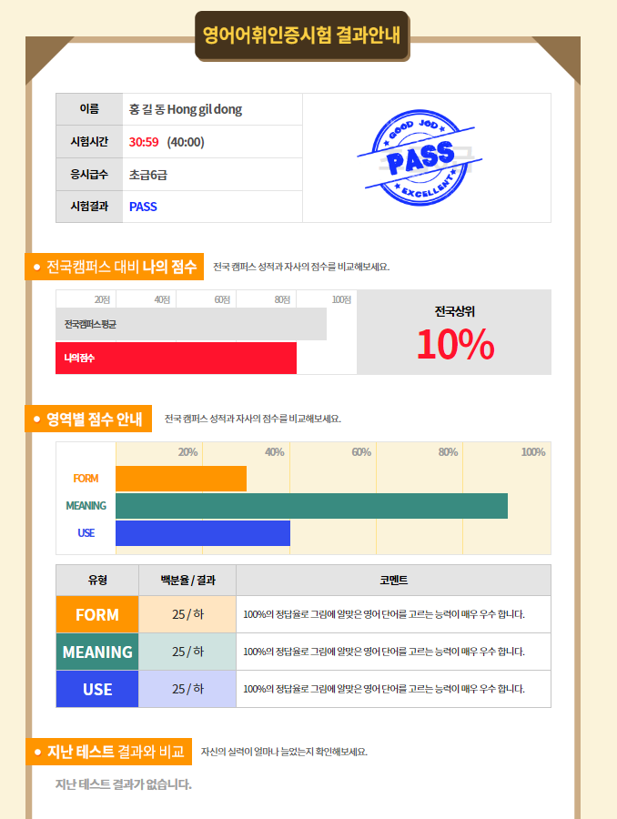

### jr.jungchul.com 사이트 리뉴얼 
- **개발기간:** 2019년 1월 ~ 8월
- **기술스택:** JavaScript, jQuery, XML, JSON AJAX, ASP, MSSQL 2005/2012 
- **주요기능:** Front, Back CRM 통계 생성 및 리뉴얼    

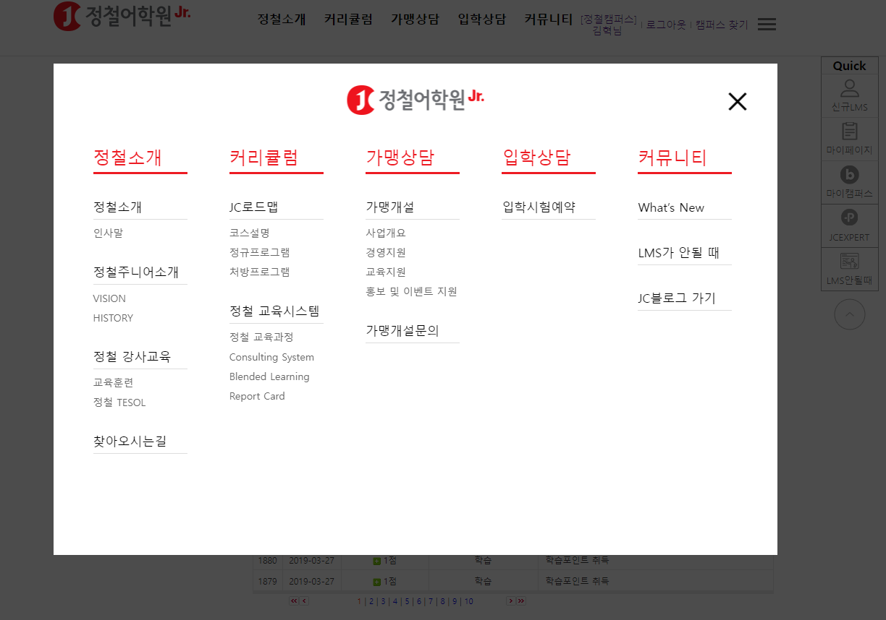

### m.jc.co.kr 주니어콘텐츠 웹앱 서비스  
- **개발기간:** 2018년 
- **기술스택:** JavaScript, jQuery, XML, JSON AJAX  
- **주요기능:** HTML4 멀티미디어 기능 이미지, 음원 재생, 테스트     

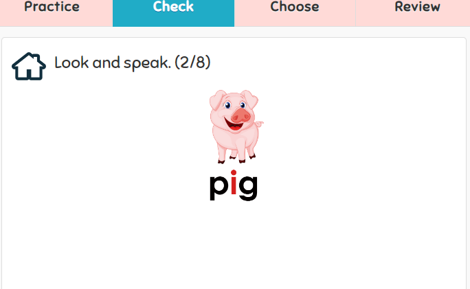
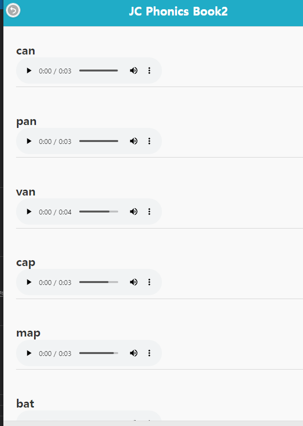

---

## ISTOCKMALL Portfolio

### 컨버스 미들웨어 운영 관리 
- **운영기간:** 2022년 10월 ~    
- **기술스택:** PHP 7.0, Apache, MySQL 5.7.33, MSSQL 2012~2016, Ubuntu 16.04.1
- **주요기능:** 주문, 판매, 재고, 수집 전송 API 서버  

### API 수정 (쿠팡, cafe24)
- **개발기간:** 2022년 10월 ~ 2022년 12월
- **기술스택:** ASP, PHP, MSSQL, Windows 2012 R2   
- **주요기능:** 주문, 판매, 재고, 수집 전송 API 서버  
- **인프라:** 서버 관리 운영(서초동 하나로호스트, AWS)

### 미들웨어 개발 (신 스탁몰 API)
- **개발기간:** 2023년 6월 ~ 2023년 7월    
- **기술스택:** PHP, MySQL 5.7.33-0ubuntu0.16.04.1, MSSQL 2012
- **주요기능:** 자사 및 셀러 API 통계 및 로그 자료 분석에 따른 수집 
- **API 문서:** https://dev-scm.istockmall.co.kr/docs#goods

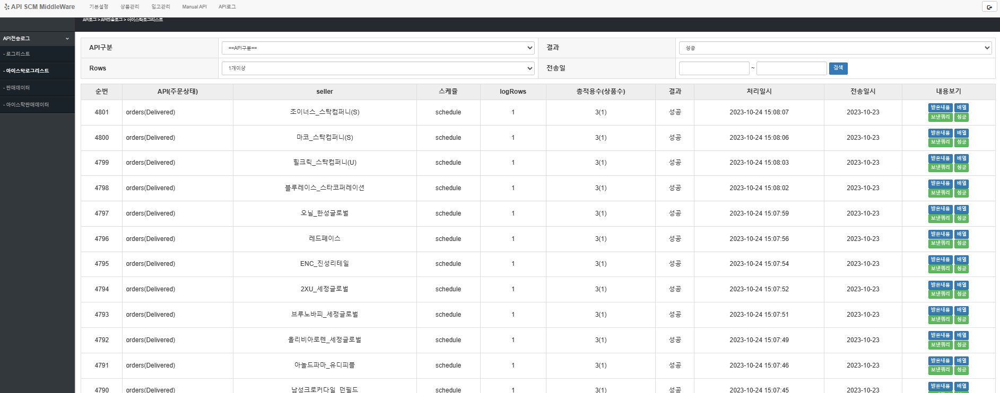
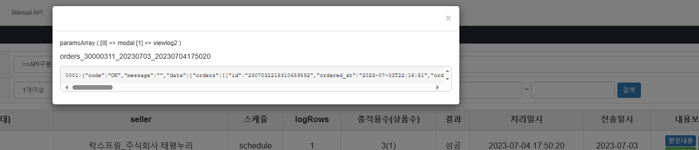
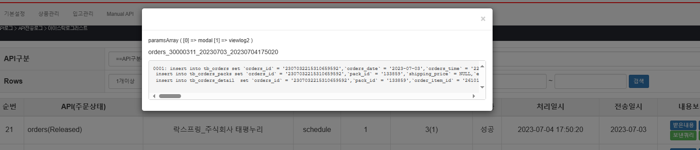
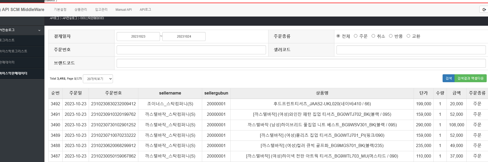
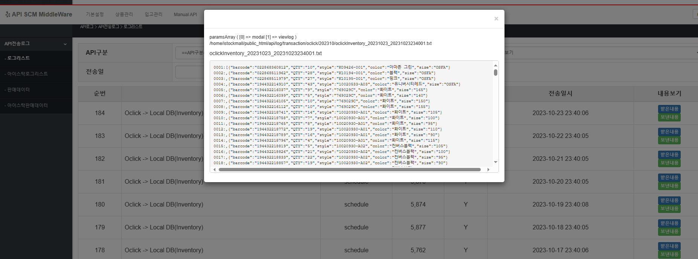

### 구 플랫폼 사이트 운영 개발 관리 
- **개발/운영기간:** 2022년 10월 ~ 2023년 5월   
- **기술스택:** ASP, MSSQL, PHP, MySQL, jQuery, JSON, XML, JavaScript     
- **주요기능:** 자사 및 셀러 플랫폼 판매 및 쿠팡, 11ST API 연동 운영 관리 
- **사이트:** https://devmain.istockmall.com (현재 개발사이트만 존재)  
- **인프라:** 서버 관리 운영(하나로호스팅)  
- **참고:** www.istockmall.co.kr (Laravel, Vue) 아웃소싱 업체에서 관리중

### 테스트 미들웨어 구축 
- **개발기간:** 2022년 10월 
- **기술스택:** PHP, MySQL 5.7.33-0ubuntu0.16.04.1, MSSQL 2012
- **주요기능:** 자사 및 셀러 API 통계 및 로그 자료 분석에 따른 수집 개발에 필요  
- **사이트:** http://cyber.multinet.store/
- **인프라:** 서버 관리 운영(OCI)  

### 테스트 Front 구축  
- **개발기간:** 2023년 7월 
- **기술스택:** Svelte  
- **주요기능:** 자사 및 셀러 테스트 API 검색 SPA(Single Page Application)
- **사이트:** http://www.multinet.store/ 
- **인프라:** 서버 관리 운영(OCI)  

### 테스트 닷넷 배포 게시 테스트   
- **개발기간:** 2023년 10월  
- **기술스택:** ASP.NET Core MVC, .NET 6.0   
- **주요기능:** 자사 쇼핑몰 테스트 사이트 
- **사이트:** https://net-mvc.istockmall.com/ (2024년 2월 29일 운영 중지)
- **인프라:** 서버 관리 운영(하나로호스팅)

### 아마존 서비스 
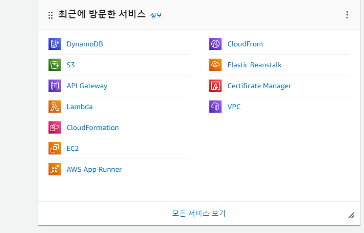

---

## 📞 연락처 및 링크
- **GitHub Repository:** https://github.com/hduhwan-git/Portfolio